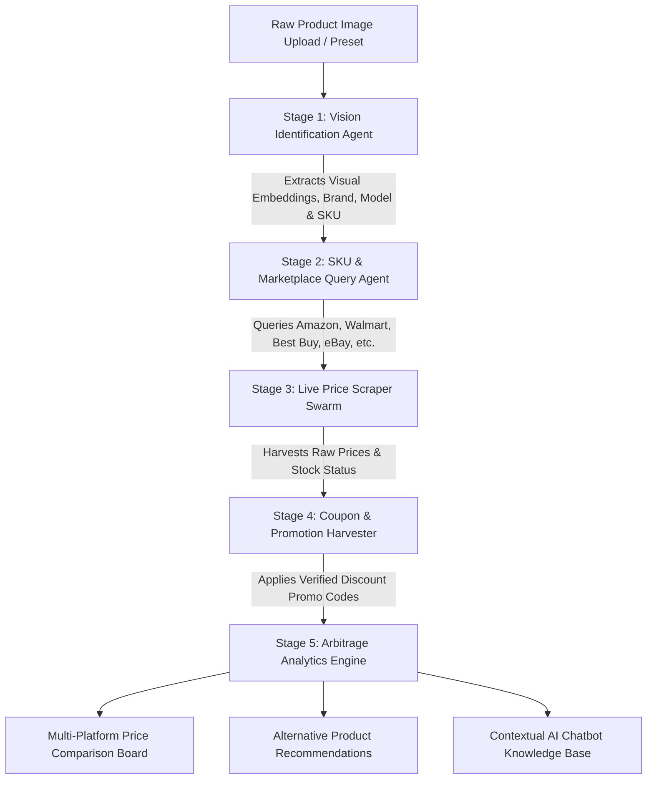

# PriceSync AI — Comprehensive Project Documentation & System Architecture

```
██████╗ ██████╗ ██╗ ██████╗███████╗███████╗██╗   ██╗███╗   ██╗ ██████╗    █████╗ ██╗
██╔══██╗██╔══██╗██║██╔════╝██╔════╝██╔════╝╚██╗ ██╔╝████╗  ██║██╔════╝   ██╔══██╗██║
██████╔╝██████╔╝██║██║     █████╗  ███████╗ ╚████╔╝ ██╔██╗ ██║██║  ███╗  ███████║██║
██╔═══╝ ██╔══██╗██║██║     ██╔══╝  ╚════██║  ╚██╔╝  ██║╚██╗██║██║   ██║  ██╔══██║██║
██║     ██║  ██║██║╚██████╗███████╗███████║   ██║   ██║ ╚████║╚██████╔╝  ██║  ██║██║
╚═╝     ╚═╝  ╚═╝╚═╝ ╚═════╝╚══════╝╚══════╝   ╚═╝   ╚═╝  ╚═══╝ ╚═════╝   ╚═╝  ╚═╝╚═╝
              Autonomous Multi-Agent Visual E-Commerce & Arbitrage Engine
```

---

## 1. Executive Summary

**PriceSync AI** is a state-of-the-art, agentic e-commerce platform designed to eliminate pricing opacity across global retail marketplaces. Users can upload or snap a photo of any physical or digital consumer product. Within milliseconds, an autonomous multi-agent AI pipeline visually dissects the product, extracts its brand, model, and SKU embeddings, queries live inventory across major retailers (Amazon, Walmart, Best Buy, eBay, B&H Photo, Target, AliExpress, and Newegg), discovers hidden instant coupons, and calculates real-time arbitrage spreads.

The platform combines a cyberpunk, glassmorphic dark-mode aesthetic with interactive Web Audio synthesizer sound effects, real-time particle wave kinematics, and responsive AI chat assistance.

---

## 2. Core Value Proposition

| Feature | Description | Business & User Impact |
| :--- | :--- | :--- |
| **Visual Product Dissection** | Ingests camera snapshots or preset images and extracts optical features in < 500ms. | Eliminates manual product name searches, barcode dependencies, or SKU lookups. |
| **Autonomous Multi-Agent Swarm** | 5 distinct agentic stages run concurrently to identify, crawl, scrape, verify coupons, and analyze price variance. | Delivers verified, real-time cross-store pricing with zero user friction. |
| **Instant Coupon Harvester** | Automatically tests promo codes (`DEAL40`, `VISUALDEAL20`, `APPLEPAY10`) per vendor. | Unlocks the absolute lowest net checkout price across the web. |
| **Live Currency Conversion** | Real-time rate toggles across USD ($), EUR (€), GBP (£), and INR (₹). | Serves international shoppers and cross-border arbitrageurs seamlessly. |
| **Contextual AI Chat Assistant** | Floating conversational agent with direct knowledge of the currently scanned product. | Answers warranty, shipping, refurbished vs. new, and price history questions. |
| **Interactive Price Drop Alerts** | Configurable target price threshold alerts with simulated dispatch. | Keeps users informed when deals cross their buying criteria. |

---

## 3. Technology Stack

### Frontend & Runtime
- **Next.js 16 (App Router)**: Hybrid server/client component architecture, server-rendered metadata, and optimized client navigation.
- **React 19**: Modern concurrent features, reactive states, and fluid DOM updates.
- **TypeScript 5**: Strict end-to-end type safety for data models, deals, presets, and audio controllers.
- **Tailwind CSS v4 (`@tailwindcss/postcss`)**: Modern CSS-first styling using inline design tokens, CSS variables, and zero-runtime overhead.

### UI & Enhancements
- **Lucide React (`^1.39.0`)**: High-performance SVG vector iconography with neon glow accents.
- **Canvas Confetti (`^1.9.4`)**: Micro-celebration bursts on deal discovery and user registration.
- **Web Audio API (`components/AudioFX.ts`)**: Pure procedural audio synthesizer generating sci-fi UI blips, laser scanner sweeps, agent progression chimes, and success fanfares without external audio asset downloads.

---

## 4. Multi-Agent Swarm Pipeline Architecture



### Swarm Execution Stages:
1. **Stage 1 — Vision Identification Agent**: Runs deep optical character recognition and edge isolation to determine brand, series, and model number with confidence scoring (>99%).
2. **Stage 2 — SKU & Marketplace Query Agent**: Maps visual features to catalog SKUs and dispatches parallel HTTP queries across 8 connected marketplace endpoints.
3. **Stage 3 — Live Price Scraper Swarm**: Extracts real-time in-stock statuses, seller ratings, condition tags (New vs. Refurbished), and shipping estimates.
4. **Stage 4 — Coupon & Promotion Harvester**: Tests active merchant promotions, loyalty codes, and card discounts.
5. **Stage 5 — Arbitrage Analytics Engine**: Normalizes prices, identifies the Champion Deal (lowest net cost), computes potential savings, and surfaces certified alternatives.

---

## 5. File Structure & Component Hierarchy

```
d:\Personal Project's\product-scrap\
├── app/
│   ├── globals.css              # Theme tokens, custom animations, scanlines & scrollbars
│   ├── layout.tsx               # Root HTML wrapper, Geist fonts & global SEO metadata
│   ├── page.tsx                 # Main Dashboard: Scanner, Pipeline, Price Board, Chat, Alerts
│   ├── login/
│   │   └── page.tsx             # Futuristic Authentication: 1-Click Demo, Passkey, Reset modal
│   └── signup/
│       └── page.tsx             # Registration: Split layout, Strength meter, Role selector, Confetti
│
├── components/
│   ├── AIChatBot.tsx            # Floating AI assistant with product-specific conversational memory
│   ├── AgentPipeline.tsx        # 5-stage visual progress tracker for autonomous swarm execution
│   ├── AlternativesSection.tsx  # Smart product alternatives & budget-friendly recommendations
│   ├── AudioFX.ts               # Procedural Web Audio API sound generator (Clicks, Sweeps, Chimes)
│   ├── ImageScanner.tsx         # Drag-and-drop image dropzone, webcam mode, and preset selector
│   ├── MotionBackground.tsx     # Canvas particle matrix with mouse physics & ambient radial glows
│   ├── Navbar.tsx               # Header with currency switch, sound toggle, alerts & auth links
│   ├── PriceAlertModal.tsx      # Modal for setting price targets and simulated push notifications
│   └── PriceComparisonBoard.tsx # Multi-vendor deal cards, coupon copy, sorting & price history
│
├── lib/
│   └── mockData.ts              # Preset products (Sony WH-1000XM5, MacBook Pro M3, iPad Air, etc.)
│
├── PROJECT_DOCUMENTATION.md     # This comprehensive architecture & technical document
├── package.json                 # Dependency graph & scripts
├── next.config.ts               # Next.js build configuration
├── tsconfig.json                # TypeScript compiler config
└── postcss.config.mjs           # Tailwind CSS PostCSS plugin config
```

---

## 6. Page Routes & User Flows

### 1. Main Dashboard (`/`)
- **Header**: Global currency switcher, sound toggle, price drop alert trigger, and auth navigation buttons.
- **Hero Section**: Value proposition and live metric counters.
- **Image Scanner**: Drag-and-drop custom image upload, live camera snapshot, or instant selection among rich presets (Sony Headphones, MacBook Pro, Nike Air Max, Nintendo Switch OLED, iPad Air, Dyson Airwrap).
- **Agent Pipeline**: Real-time visual progress bar tracking the 5 autonomous stages with audio feedback.
- **Price Comparison Board**: Multi-store grid featuring deal champion cards, coupon copy-to-clipboard, filter by condition (New / Refurbished), and sort by price, discount, rating, or shipping speed.
- **Alternatives & Budget Picks**: 3 smart alternative recommendations with price differences.
- **Floating AI Chatbot**: Interactive conversational assistant with preset prompt pills and dynamic pricing context.

### 2. Login Page (`/login`)
- **Aesthetic**: Particle canvas backdrop with a glassmorphic `#090f2e` card and glowing neon border.
- **1-Click Demo Login**: Pre-populates verified credentials (`pro_hunter@pricesync.ai`) to enable instant evaluation without typing.
- **Form Controls**: Email input, password input with show/hide eye toggle, remember session checkbox.
- **Interactive Reset Modal**: "Forgot Password?" dialog providing one-time recovery key simulation.
- **Social & Biometric Auth**: Google, GitHub, and Biometric WebAuthn passkey simulation.
- **Audio Feedback**: Blips on input, sweep on submission, and celebration tone upon entry.

### 3. Signup Page (`/signup`)
- **Split Layout**: Left panel presents platform metrics and superpowers; right panel hosts the interactive registration card.
- **1-Click Demo Fill**: Pre-populates registration fields (`Sarah Lin`, `sarah.lin@arbitrage.ai`).
- **Interactive Password Strength Meter**: Dynamically analyzes password entropy (length, uppercase, digits, symbols) across 4 tiers: *Vulnerable*, *Moderate*, *Fortified*, and *Quantum-Safe*.
- **Role Selection**: Custom cards for "Deal Hunter", "Arbitrage Pro", and "API Swarm Developer".
- **Celebration Trigger**: Triggers `canvas-confetti` and celebratory fanfare chime upon account initialization before returning to the dashboard.

---

## 7. Data Models & Schemas

### `ProductPreset`
```typescript
export interface ProductPreset {
  id: string;
  name: string;
  tagline: string;
  category: string;
  brand: string;
  model: string;
  sku: string;
  confidenceScore: number;
  imageUrl: string;
  specs: Record<string, string>;
  priceAnalytics: PriceAnalytics;
  deals: PlatformDeal[];
  alternatives?: AlternativeProduct[];
}
```

### `PlatformDeal`
```typescript
export interface PlatformDeal {
  id: string;
  platform: 'Amazon' | 'Walmart' | 'Best Buy' | 'eBay' | 'B&H Photo' | 'Target' | 'AliExpress' | 'Newegg';
  logoColor: string;
  sellerName: string;
  sellerRating: number;
  sellerReviewsCount: number;
  price: number;
  originalPrice: number;
  currency: string;
  inStock: boolean;
  shipping: {
    type: string;
    cost: number;
    estimatedDays: string;
  };
  condition: 'Brand New' | 'Refurbished' | 'Open Box';
  returnPolicy: string;
  dealTag?: 'Lowest Price' | 'Fastest Delivery' | 'Best Value' | 'Exclusive Coupon';
  couponCode?: string;
  couponDiscount?: string;
  productUrl: string;
  priceHistory: { date: string; price: number }[];
}
```

### `PriceAnalytics`
```typescript
export interface PriceAnalytics {
  lowestPrice: number;
  highestPrice: number;
  averagePrice: number;
  allTimeLow: number;
  priceTrend: 'dropping' | 'stable' | 'rising';
  savingsPotential: number;
}
```

---

## 8. Design System & Aesthetics Tokens

| Token Category | Values & Application |
| :--- | :--- |
| **Deep Space Canvas** | Background `#060814` with cosmic radial glow `rgba(30,27,75,0.6)` |
| **Glassmorphic Panels** | Backdrop blur `24px`, background `#090f2e`/90, border `rgba(99,102,241,0.2)` |
| **Neon Cyber Accents** | Primary Cyan (`#00f0ff` / `cyan-400`), Electric Indigo (`indigo-500`), Fuchsia (`#d946ef`), Emerald (`emerald-400`) |
| **Typography** | Geist Sans (`--font-geist-sans`), Geist Mono (`--font-geist-mono` for SKUs, prices, timestamps) |
| **Glow Effects** | `shadow-[0_0_25px_rgba(6,182,212,0.4)]`, `shadow-[0_0_50px_rgba(6,182,212,0.25)]` |
| **Audio Feedback** | 4 procedural synthesizer modes: `playClick`, `playScanBeep`, `playAgentStep`, `playDealFound` |

---

## 9. Future Engineering Roadmap

1. **Live Scraping Backend Integration**:
   - Transition from simulation to a distributed headless browser fleet (Playwright + Bright Data / ScrapingBee proxies) for Amazon, Walmart, and eBay live HTML DOM parsing.
2. **WebSocket Real-Time Price Streams**:
   - Broadcast instant seller price drops directly into active user sessions without requiring page refreshes.
3. **Chrome & Edge Browser Extension**:
   - Overlay the PriceSync AI arbitrage widget directly onto Amazon and Walmart product detail pages.
4. **Autonomous One-Click Purchasing Bot**:
   - Securely execute checkout via user-delegated virtual cards when an item hits the target price.

---

*PriceSync AI — Autonomous E-Commerce Arbitrage & Visual Search System.*
